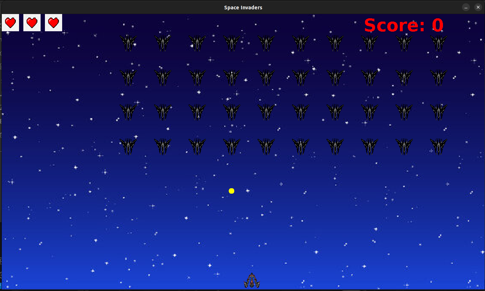

# space-invaders
Space invaders game.

My own version of the single player space-invaders game.

# Getting Started

1. Download the repo in the .zip format, extract it to the directory of your choice.
2. cd into the repo after extracting
  ```sh
  cd ~/space-invaders
  ```
## Prerequisites

Java 11 and above.
Screen size greate than 1400x800 pixels.Game window is not resizable.

  ```sh
  cd ~/space-invaders              // if did not followng Getting started section


  //Run the game jar file

  java -jar /libs/space-invaders-1.0.jar
  
  ```
#Screenshot


# Controls
1. <u>__Move left__</u>
    - LEFT arrow button
2. <u>__Move Right__</u>
    - RIGHT arrow button
3. <u>__Shoot__</u>
    - Space button / Up arrow button

# Exit/ Game Over
- To exit the game, just close the panel with the X on the top right corner of your screen


# Declaimer
- Game still in development, more features can be added and test coverage missing. It was just a game created to learn OOPs concepts.